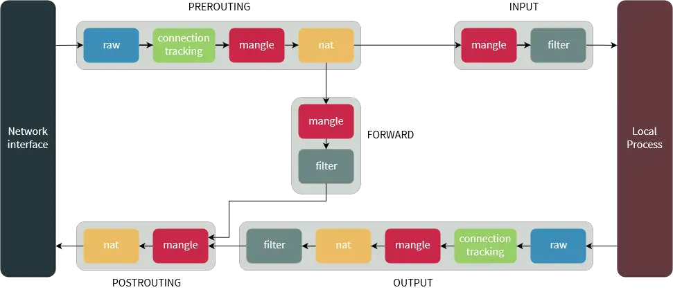
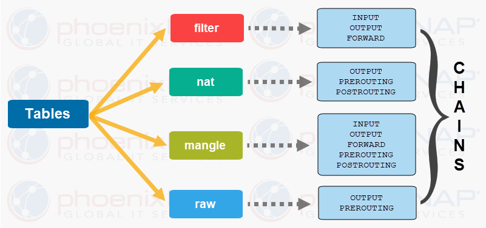

# IpTables.Api

API for local iptables management

IpTables.Api is the RESTful server that applies iptables rules to block or allow IP addresses on request from a remote client.
IpTables.Api maintains a list of blocked IP addresses which may be updated on the fly from many sources.
IpTables.Api also solves the problem of concurrent modifications to iptables since the requests are serialized.

This project is powered on [IPTables.Net](https://github.com/splitice/IPTables.Net) for interacting with Linux IPTables

## How iptables Work

**Note: This below article is just a copy from <https://phoenixnap.com/kb/iptables-tutorial-linux-firewall>**


*Source: <https://www.booleanworld.com/depth-guide-iptables-linux-firewall/>*

Network traffic is made up of packets. Data is broken up into smaller pieces (called packets), sent over a network, then put back together. Iptables identifies the packets received and then use a set of rules to decide what to do with them.

Iptables filter packets based on:

* Tables: Tables are files that join similar actions. A table consists of several chains.
* Chains: A chain is a string of rules. When a packet is received, iptables finds the appropriate table and then runs it through the chain of rules until it finds a match.
* Rules: A rule is a statement that tells the system what to do with a packet. Rules can block one type of packet, or forward another type of packet. The outcome, where a packet is sent, is called a target.
* Targets: A target is a decision of what to do with a packet. Typically, this is to accept it, drop it, or reject it (which sends an error back to the sender).

### Tables and Chains



Linux firewall iptables have four default tables. We will list all four along with the chains each table contains.

#### 1. Filter

The Filter table is the most frequently used one. It acts as a bouncer, deciding who gets in and out of your network. It has the following default chains:

* Input: the rules in this chain control the packets received by the server.
* Output: this chain controls the packets for outbound traffic.
* Forward: this set of rules controls the packets that are routed through the server.

#### 2. Network Address Translation (NAT)

This table contains NAT (Network Address Translation) rules for routing packets to networks that cannot be accessed directly. When the destination or source of the packet has to be altered, the NAT table is used. It includes the following chains:

* Prerouting: this chain assigns packets as soon as the server receives them.
* Output: works the same as the output chain we described in the filter table.
* Postrouting: the rules in this chain allow making changes to packets after they leave the output chain.

#### 3. Mangle

The Mangle table adjusts the IP header properties of packets. The table has all the following chains we described above:

* Prerouting
* Postrouting
* Output
* Input
* Forward

#### 4. Raw

The Raw table is used to exempt packets from connection tracking. The raw table has two of the chains we previously mentioned:

* Prerouting
* Output
* Diagram with iptables and chains tables contain

#### 5. Security (Optional)

Some versions of Linux also use a Security table to manage special access rules. This table includes input, output, and forward chains, much like the filter table.

## Usage

To run, follow the below steps

1. clone this project
1. set exe permissions (such as `chmod +x build.sh`)
1. run `build.sh --configuration=Release`
1. set exe permissions (such as `chmod +x Source/BSN.IpTables.Api/bin/Release/net6.0/BSN.IpTables.Api`)
1. simply run web service with `Source/BSN.IpTables.Api/bin/Release/net6.0/BSN.IpTables.Api --urls=http://localhost:8002`

### Kamailio Example

```kamailio
loadmodule "http_client.so"
loadmodule "htable.so"
...
modparam("htable", "htable", "ipban=>size=8;autoexpire=600;")
...
if (!pike_check_req()) {
  xlog("L_ALERT","ALERT: pike blocking $rm from $fu (IP:$si:$sp)\n");
  $sht(ipban=>$si) = 1;
  http_client_query("http://localhost:8002/api/v1/rules/Append?Chain=INPUT&Data.SourceIp=$si&Data.Jump=DROP", "$var(apinfo)");
  exit;
}
...
event_route[htable:expired:ipban] {
  xlog("mytable record expired $shtrecord(key) => $shtrecord(value)\n");
  http_client_query("http://localhost:8082/api/v1/rules/Append?Chain=INPUT&Data.SourceIp=$shtrecord(key)&Data.Jump=DROP", "$var(apinfo)");
}
```

### CLI Example (Not Implemented Yet)

To connect, use the `Connect-IpTables` cmdlet:

```powershell
# Opens a new browser window to log into your account.
Connect-IpTables

# Log in with a previously created service principal. Use the the username, and the secret as password.
$Credential = Get-Credential
Connect-IpTables -Credential $Credential
```

A session context persists in login information within IpTables PowerShell modules and PowerShell instances.
Use the `Get-IpTablesContext` cmdlet to view the context you are using in the current session. The results contain
the account and subscription you are using for the current session.

```powershell
# Get the IpTables PowerShell context for the current PowerShell session
Get-IpTablesContext

# Lists all available IpTables PowerShell contexts in the current PowerShell session
Get-IpTablesContext -ListAvailable
```
